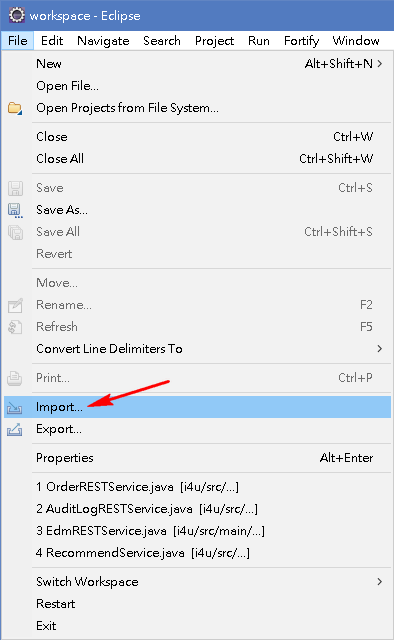
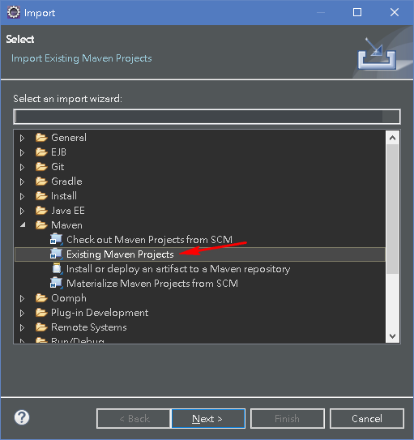
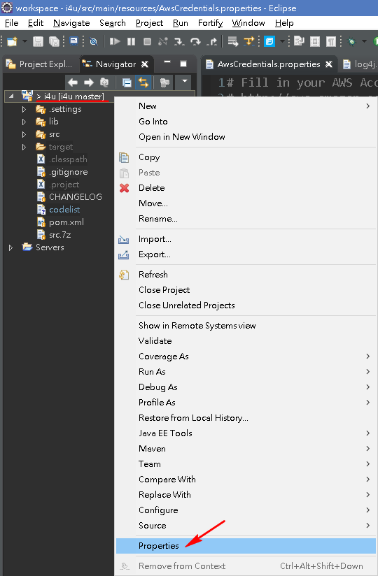
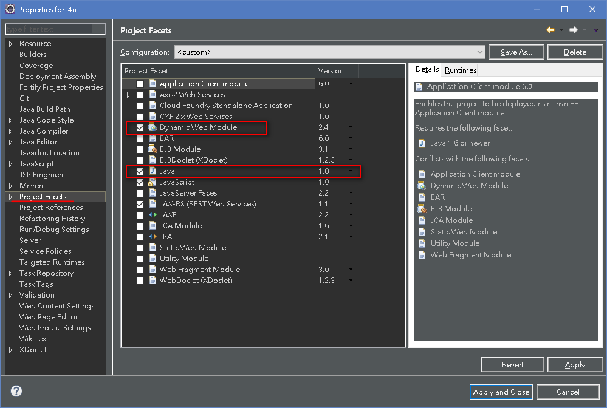
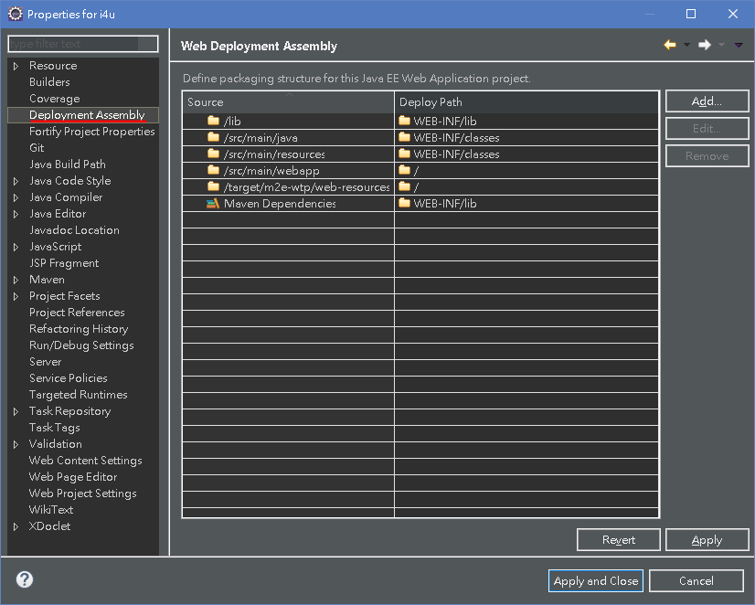
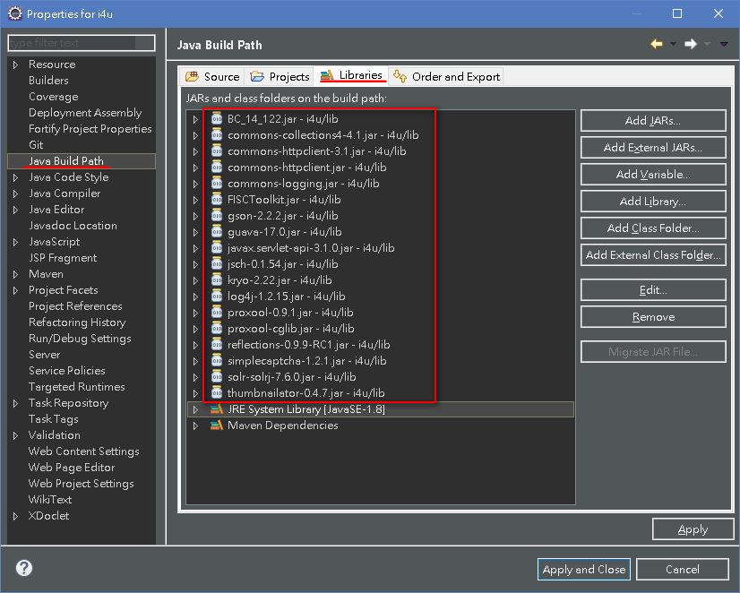
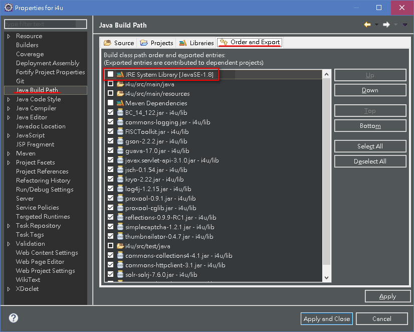
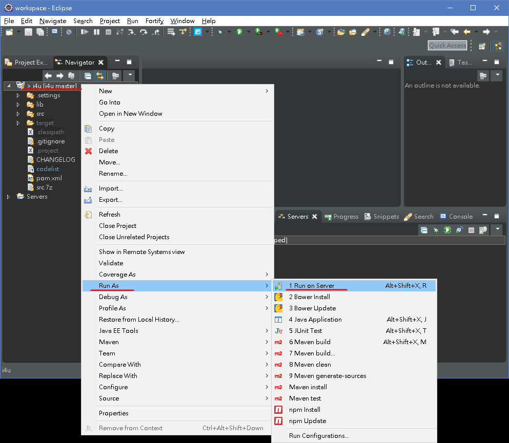
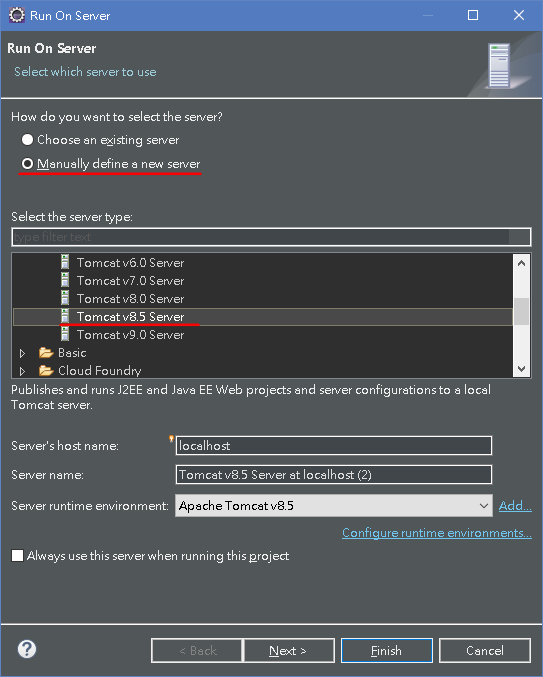
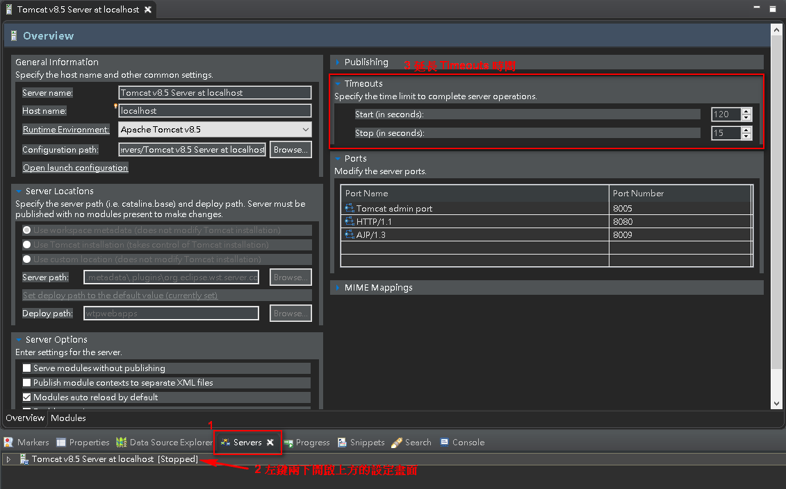

# 開發環境建置

## Git Server

`https://10.172.30.212/`
以 LDAP 帳號登入。

## 專案建置

環境需求：

- Git
- JDK 1.8
- Eclipse
- Tomcat portable v8.5
- PostgreSQL v9.6
- solr v7.6

### Get Project

<!-- TODO: update clone url -->

```sh
mkdir ./project
cd ./project/
git clone https://10.172.30.212/?? nextec
```

### Eclipse

開啟 eclipse 並匯入 maven 的現有專案：指向剛剛 clone 下來的 nextec 目錄 ( pom.xml 所在目錄)





在 eclipse 的 nextec 專案中，開啟專案的屬性頁面：



設定 `Project Facets` 中 `Java` 的版本為 1.8、並選取 `Dynamic Web Module`。
(若執行 Maven update，Java 可能會被改回舊版，要注意!)



設定 **Deployment Assembly page** 如下圖：



設定 **Java Build Path/Libraries** 加入 {/path/to/nextec/project}/lib 中的 jar 檔：



在 **Java Build Path/Order and Export** 中，移動 `JRE` 到最頂端。



### Eclipse Tomcat

在 eclipse 中加入 tomcat Server



(如果是初次設定，畫面應該會有些許不同)


隨後設定 Tomcat 所在目錄即可 (解壓後的目錄)。

### PostgreSQL

預設的測試環境帳密如下：
(如果安裝時欲設定不同的帳密，記得修改測試環境的 common.properties 檔案中相關設定，並在後續內容中自動替換。)

- Account: postgres
- Password: postgres

建立專案資料庫 `nextec` 並匯入資料庫備份檔：

```sh
cd C:\Program Files\PostgreSQL\9.6\bin

# 如果無法登入，請檢查 `C:\Program Files\PostgreSQL\9.6\data\pg_hba.conf` 設定。
psql.exe -Upostgres -h localhost
```

```sql
postgres=# create database nextec;
\q
```

```sh
pg_restore.exe -h localhost -Upostgres -d nextec -v /path/to/db_backup_file
```

若是線上資料庫的備份檔，還需要去除個資資料。
所以再次登入 db console：

```sh
psql.exe -Upostgres -h localhost nextec
```

登入後貼上下列去個資語法：

```sql
UPDATE product_order SET ship_name = 'na' , ship_addr = 'na' , ship_phone_number_house = 'na', ship_phone_number_mobile = 'na', member_email = 'tlz_vic@cht.com.tw'; 
UPDATE member SET name = 'NA', email = 'tlz_vic@cht.com.tw'; 
UPDATE address_template SET address = 'NA' , name = 'NA' , phone_number = 'NA',addrother = 'NA'; 
UPDATE supplier_info SET email = 'tlz_vic@cht.com.tw', bill_email = 'tlz_vic@cht.com.tw';
UPDATE operator SET email = 'tlz_vic@cht.com.tw';
UPDATE receive_address set address = 'NA';
UPDATE hamimall_member SET name = 'NA',nickname = 'NA', email = 'tlz_vic@cht.com.tw', edm_email = 'tlz_vic@cht.com.tw', mobile = NULL, login_ip = NULL;
UPDATE hamimall_receive_address SET name = 'NA', mobile_phone_number = NULL, landline_phone_number = NULL, address = NULL, addrother = '測試地址';
UPDATE hamimall_product_order SET member_email = 'tlz_vic@cht.com.tw', member_name = 'NA', ship_name = 'NA', ship_mobile_phone_number = NULL, ship_landline_phone_number = NULL,ship_addr = '測試地址';
```

### Solr

待續...

## Memo

- eclipse 如果出現 nextec 設定檔無法更新，或 Deployment Assembly page 無法顯示

  ```sh
  rm -rf nextec/.settings nextec/.project
  ```

  然後重新匯入 nextec

- eclipse maven 連線錯誤

  手動設定 maven proxy `%USERPROFILE%\.m2\settings.xml`

  ```xml
  <settings xmlns="http://maven.apache.org/SETTINGS/1.0.0"
    xmlns:xsi="http://www.w3.org/2001/XMLSchema-instance"
    xsi:schemaLocation="http://maven.apache.org/SETTINGS/1.0.0
                        https://maven.apache.org/xsd/settings-1.0.0.xsd">
    <proxies>
      <proxy>
        <id>myproxy</id>
        <active>true</active>
        <protocol>http</protocol>
        <host>proxy.cht.com.tw</host>
        <port>8080</port>
      </proxy>
    </proxies>
  </settings>
  ```

- eclipse `Run on Server` 逾時導致專案起動失敗

  
