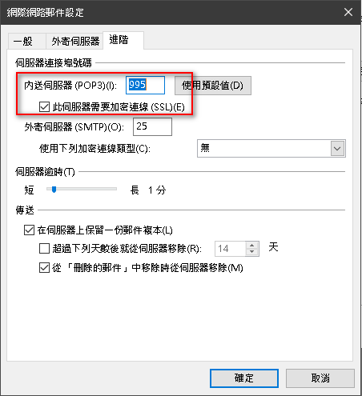

# 辦公室相關

## NTP Server

```
10.144.180.60
```

## Proxy

```
http://autoproxy.cht.com.tw/proxy.pac
```

## email

### webmail

<https://webmail.cht.com.tw/>

### outlook

- pop3: webmail.cht.com.tw
- smtp: webmail.cht.com.tw



## Printer

| Name                   | IP            |
|------------------------|---------------|
| HP Color LaserJet M855 | 10.144.20.203 |
| HP LaserJet 700 M712   | 10.144.20.200 |
| EPSON AL-MX300         | 10.144.20.202 |

## Website

- NUEiP : <https://cloud.nueip.com/login>
- Jira : <https://jira8.cht.com.tw/jira/login.jsp>
- CHTTL : <http://web.chttl.com.tw/>
- 更改密碼 : <https://dsacc.cht.com.tw/account/home.jsp>
- 新冠肺炎防疫系統 : <https://sites.google.com/view/csi-covid-19/%E9%A6%96%E9%A0%81>
