# 防火牆

假定需設定 CHTD DSIS 介接，由 DSIS sftp 連到我方 admin-1 主機。

- DSIS Source IP: 203.75.129.253
- SFTP Port: 22

## 設定一外部 IP 轉導至 admin-1，提供 DSIS 連入連線。

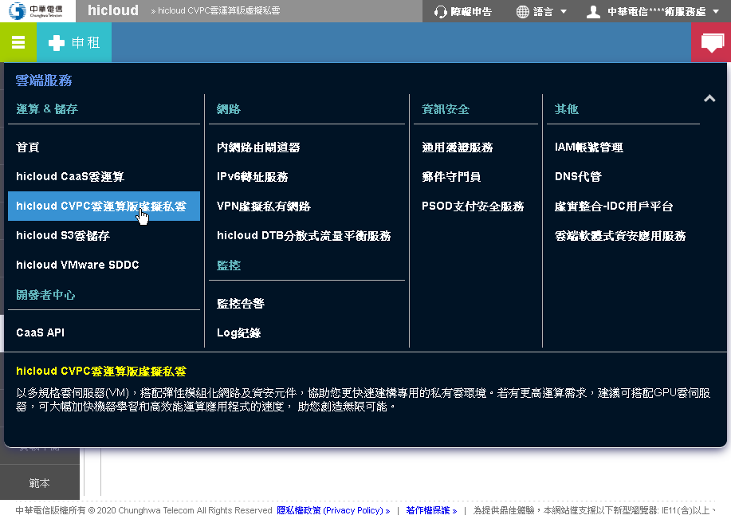
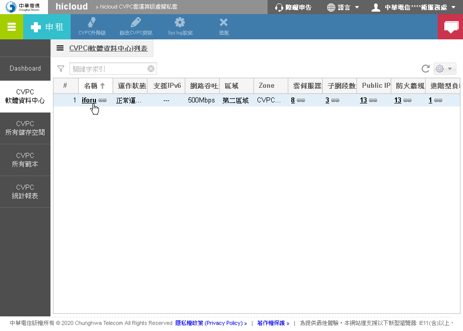
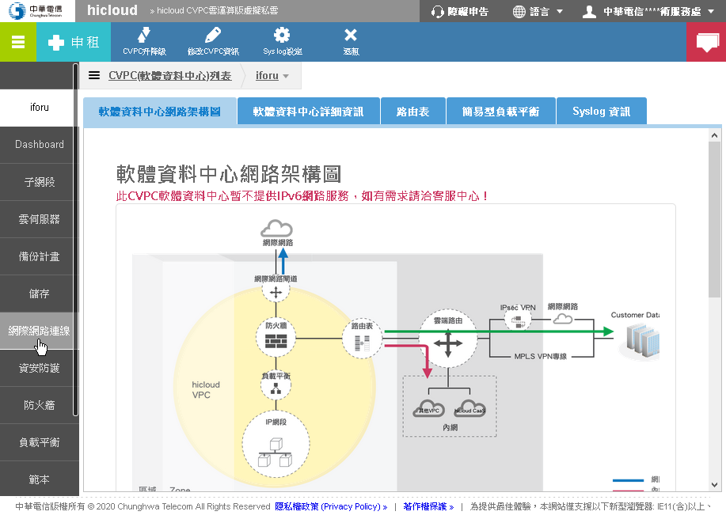
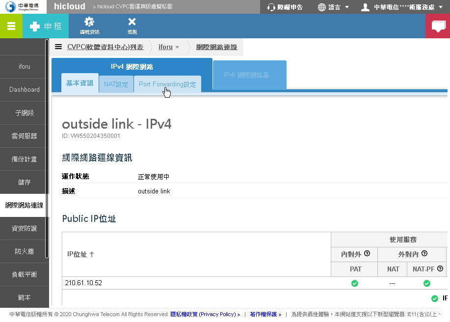
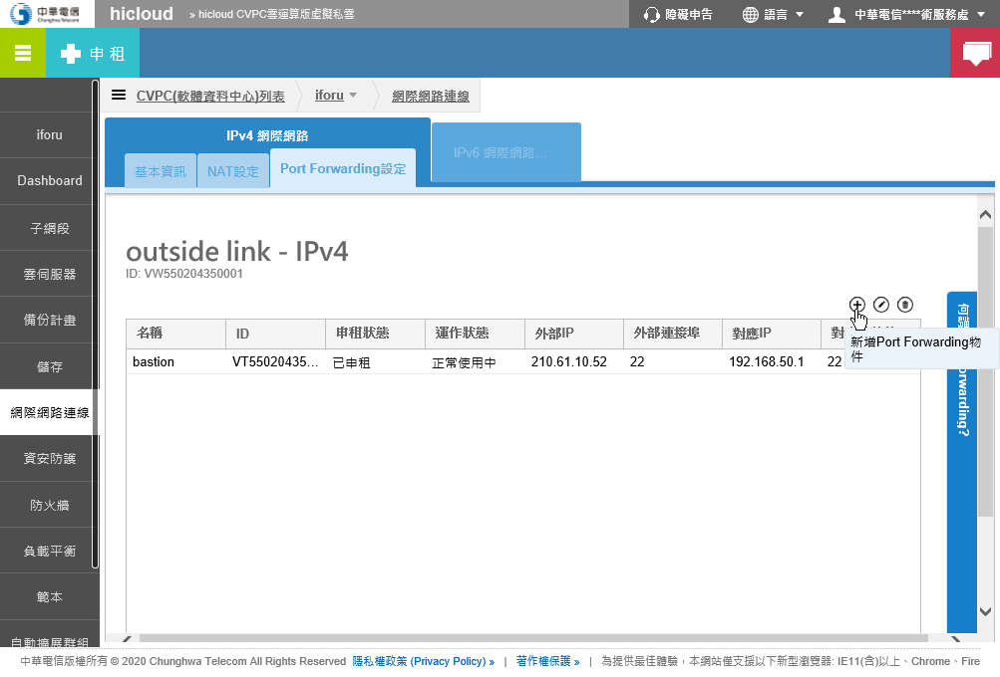
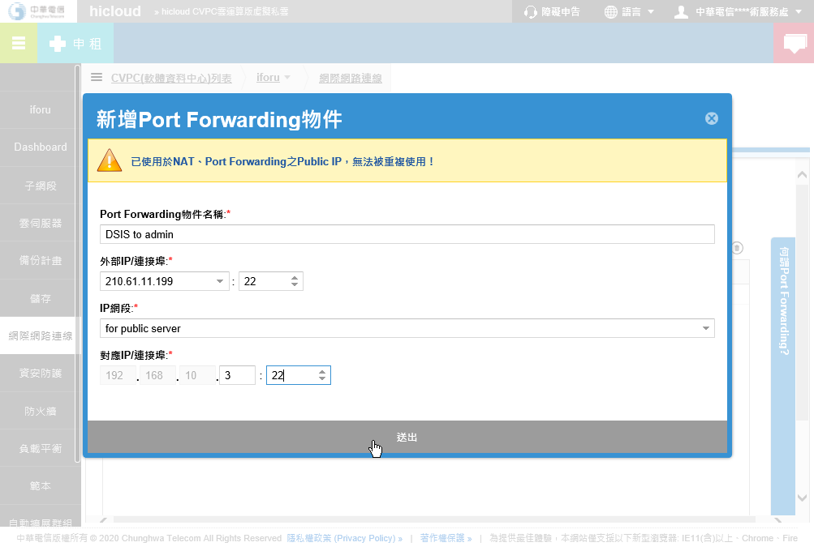

## 開通 DSIS 連入防火牆設定

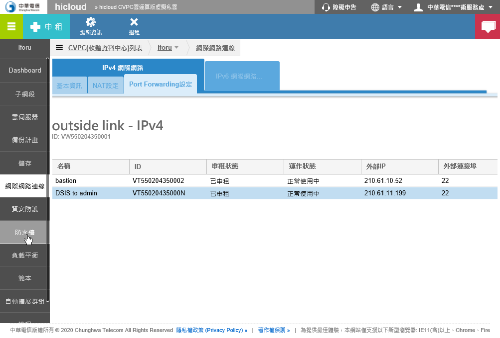
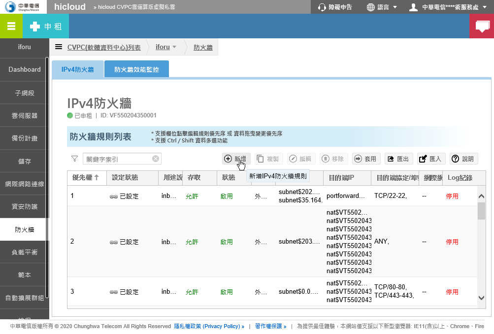

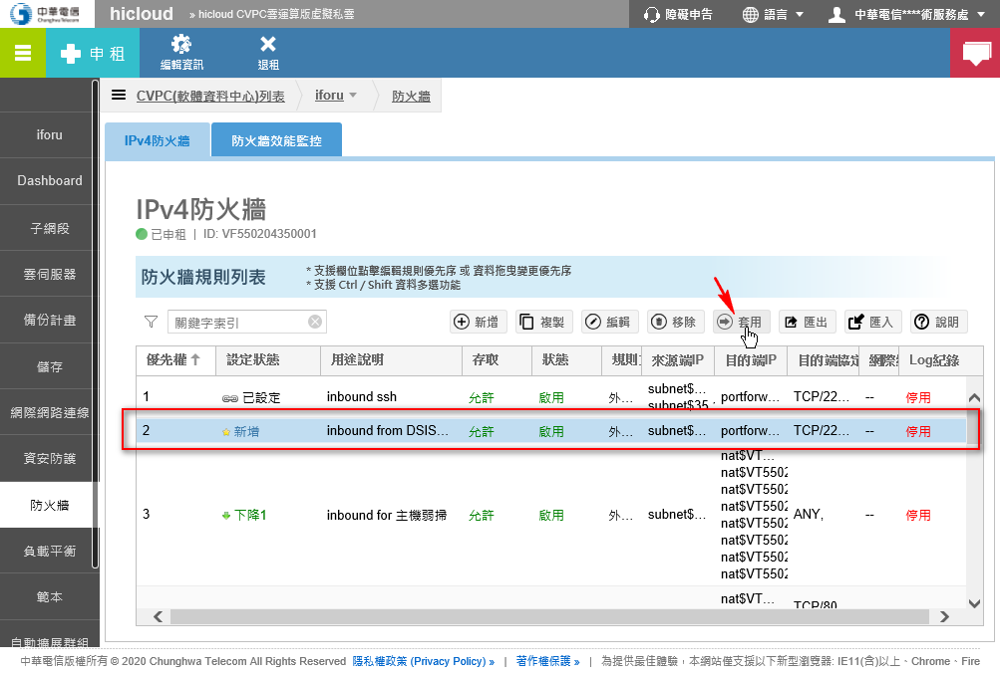
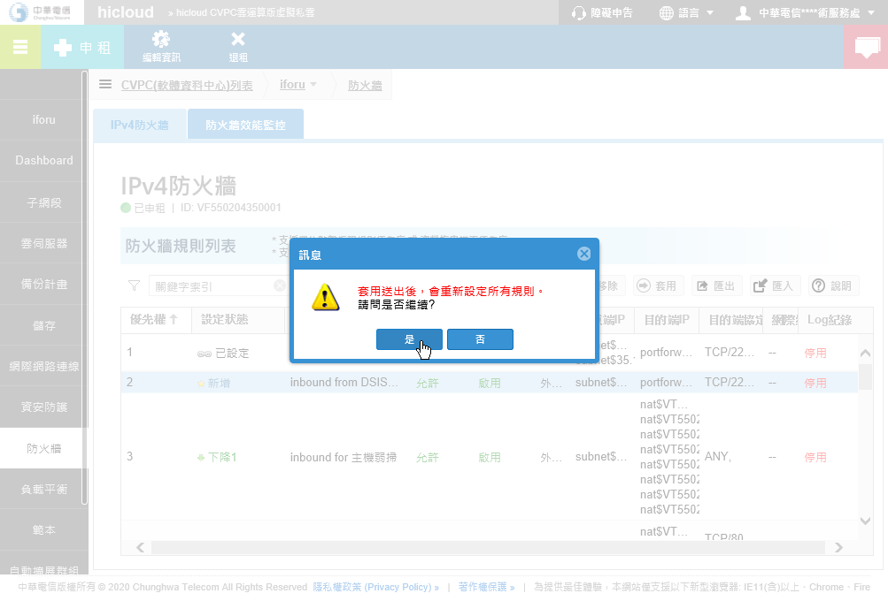
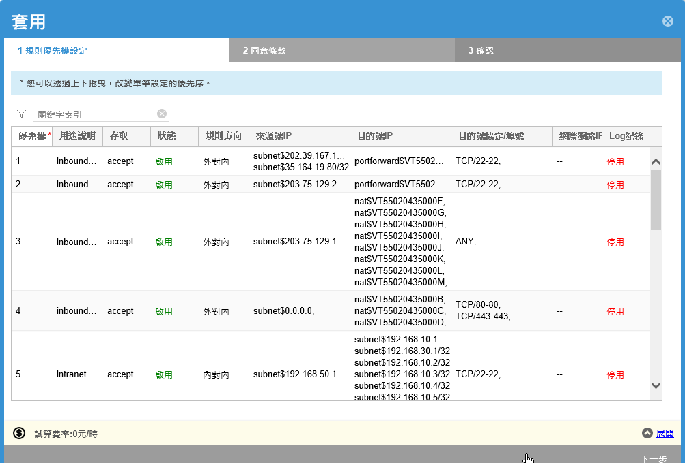
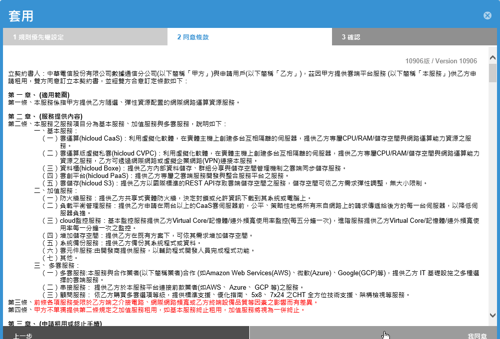
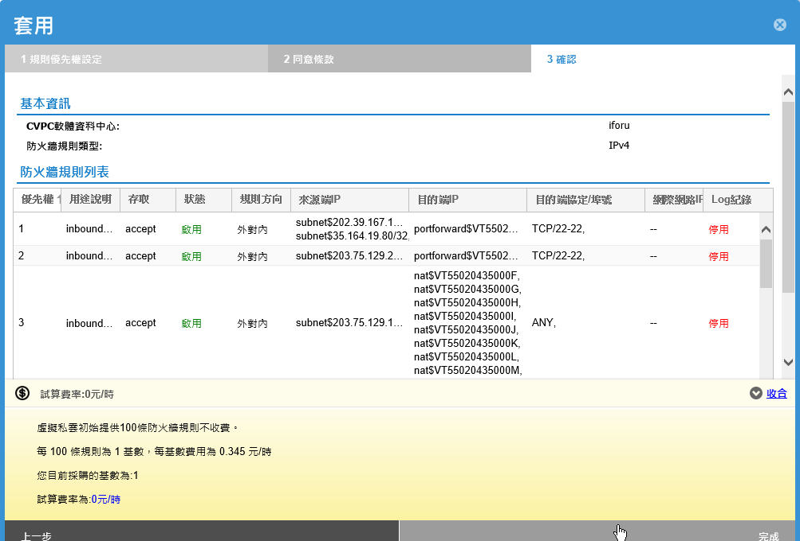
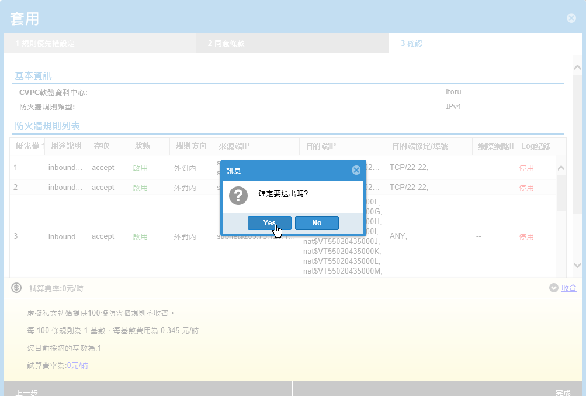
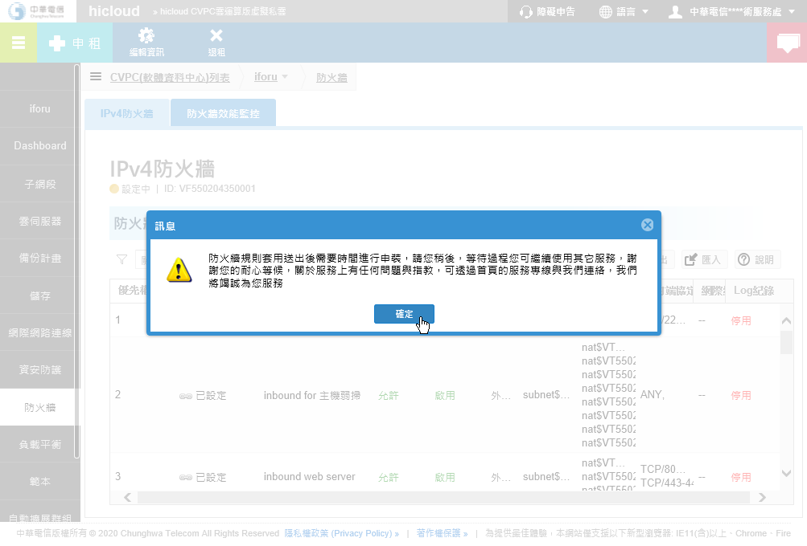

## 設定主機防火牆

```sh
firewall-cmd --zone=public --add-rich-rule='rule family="ipv4" source address="203.75.129.253/32" port port="22" protocol="tcp" accept' --permanent
firewall-cmd --reload
```
