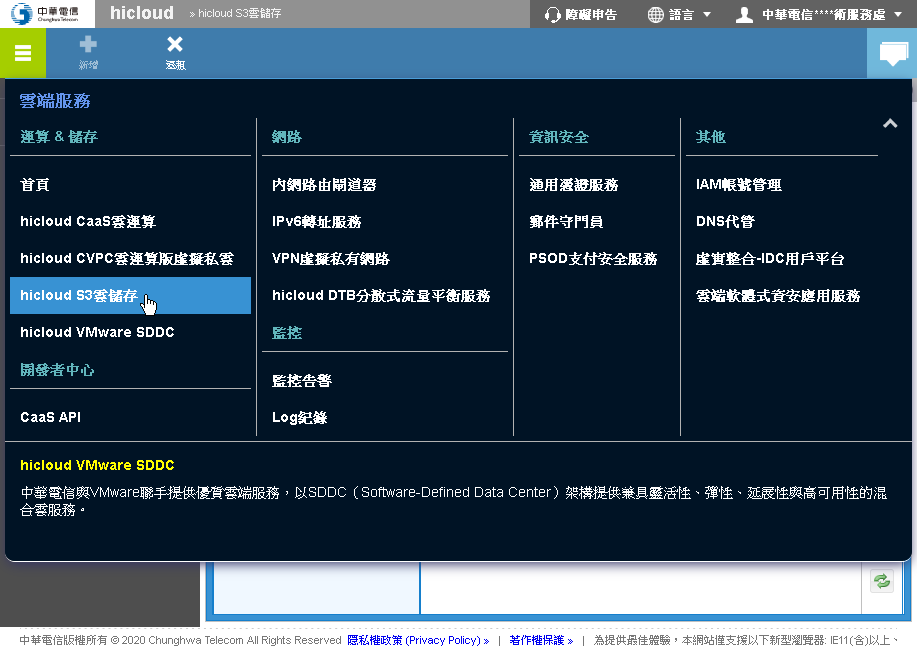
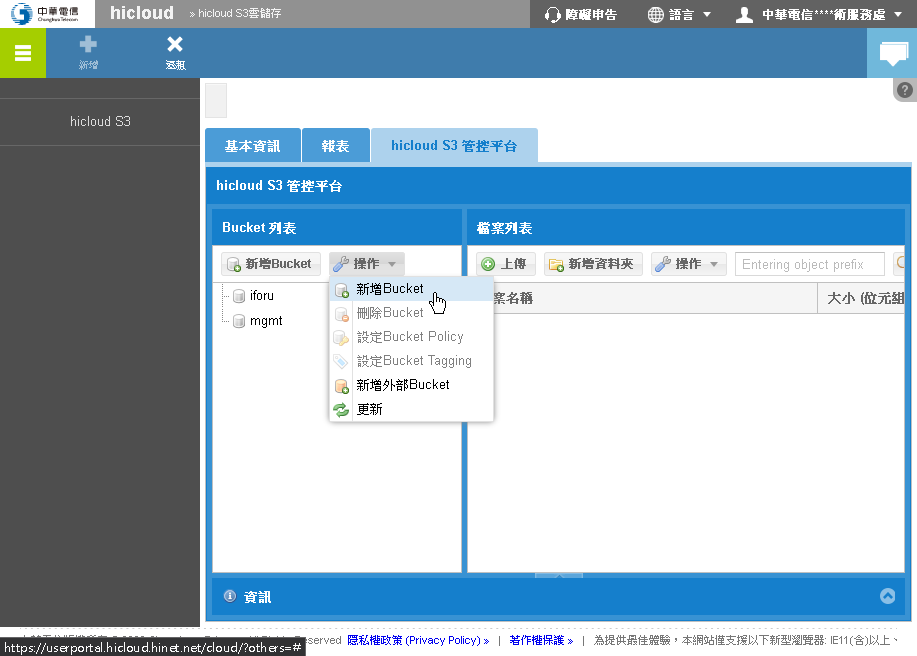
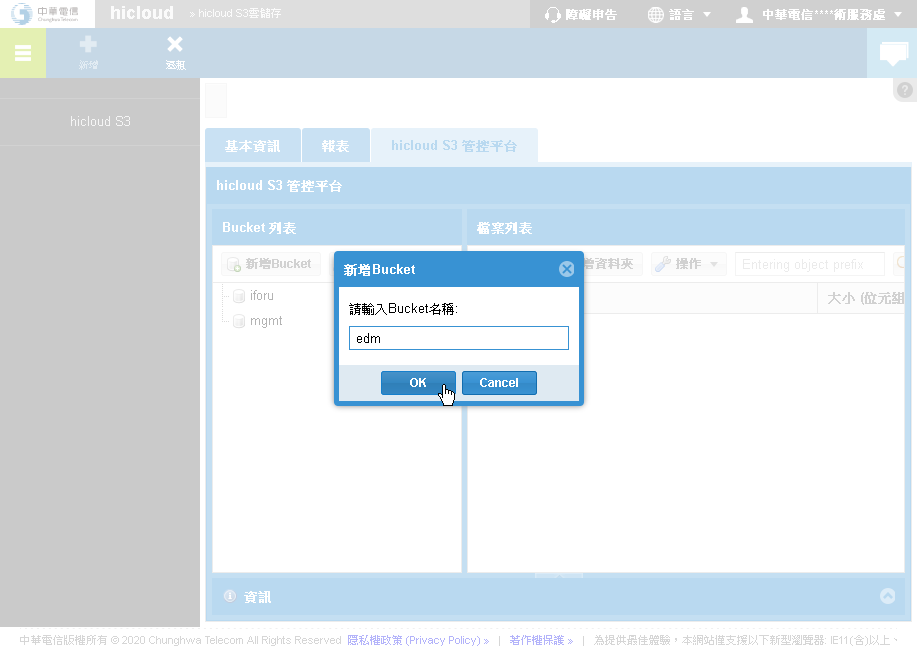
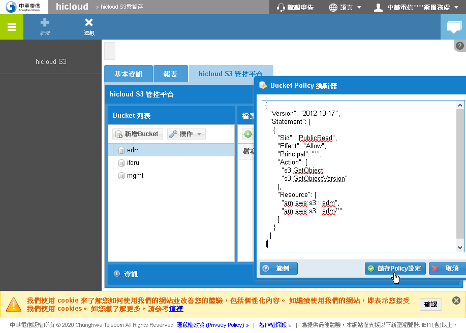
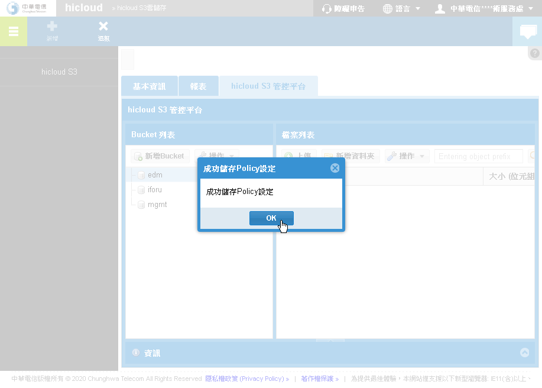

# hicloud S3

## 新增/設定 Bucket

新增 `edm` bucket 並設定允許公開存取。






Bucket Policy

```json
{
  "Version": "2012-10-17",
  "Statement": [
    {
      "Sid": "PublicRead",
      "Effect": "Allow",
      "Principal": "*",
      "Action": [
        "s3:GetObject",
        "s3:GetObjectVersion"
      ],
      "Resource": [
        "arn:aws:s3:::edm",
        "arn:aws:s3:::edm/*"
      ]
    }
  ]
}
```




## AWS S3 to Hicloud S3

備份 AWS S3 的 edm 到 Hicloud S3

install awscli v2

```sh
curl "https://awscli.amazonaws.com/awscli-exe-linux-x86_64.zip" -o "awscliv2.zip"
yum -y install unzip
unzip awscliv2.zip
./aws/install   # sudo ./aws/install
aws --version
```

```sh
aws configure
```

```
AWS Access Key ID [None]: key id
AWS Secret Access Key [None]: access key
Default region name [None]: ap-northeast-1
Default output format [None]:
```

download from aws.s3

```sh
aws s3 cp s3://edm.iforu.com.tw/ ./ --recursive
```

upload to hicloud.s3

```sh
s3cmd -r put ./ s3://edm/ 
```
