# Fortify SCA 靜態源碼檢測

白箱測試：
Fortify SCA <http://10.172.19.100/chttl/index.php?web=tltc>

CHT License: [Fortify License](./info/fortify.license)

**_注意 CHT 上的版本資訊_**

## Install

### SCA

Static Code Analyzer

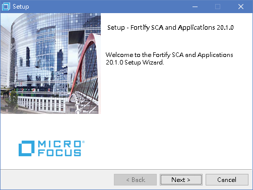
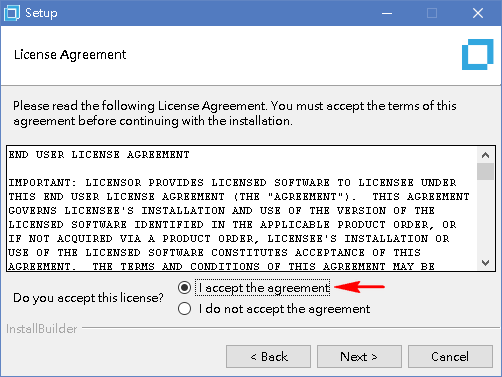
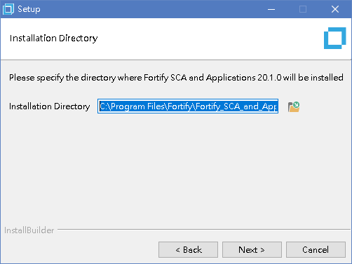
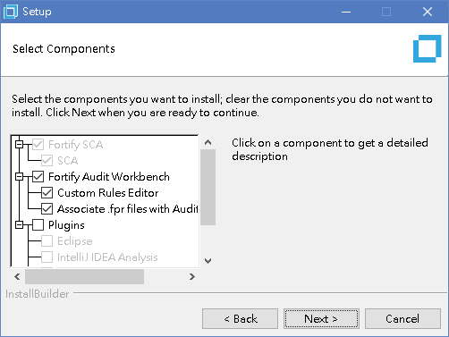
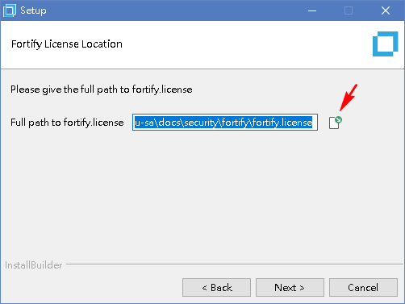
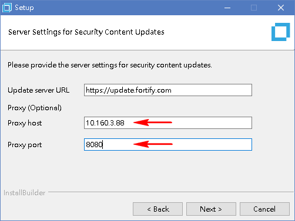
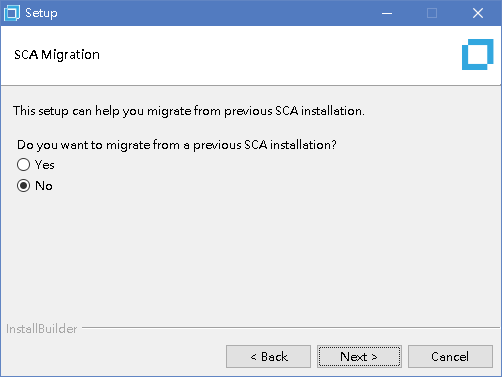
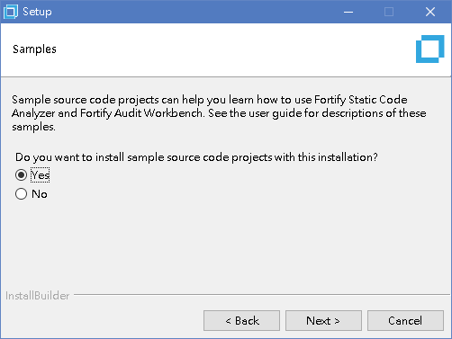
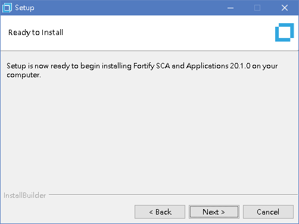
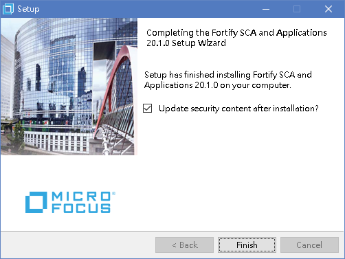
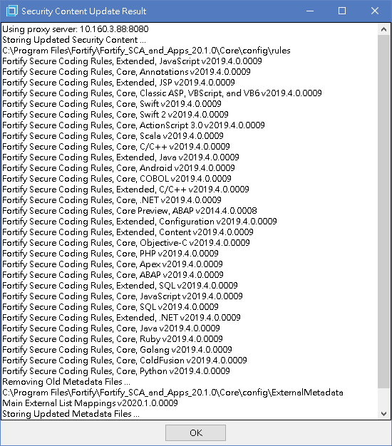

### CHT Report

`C:\Program Files\Fortify\Fortify_SCA_and_Apps_20.2.0\Core\config\reports`

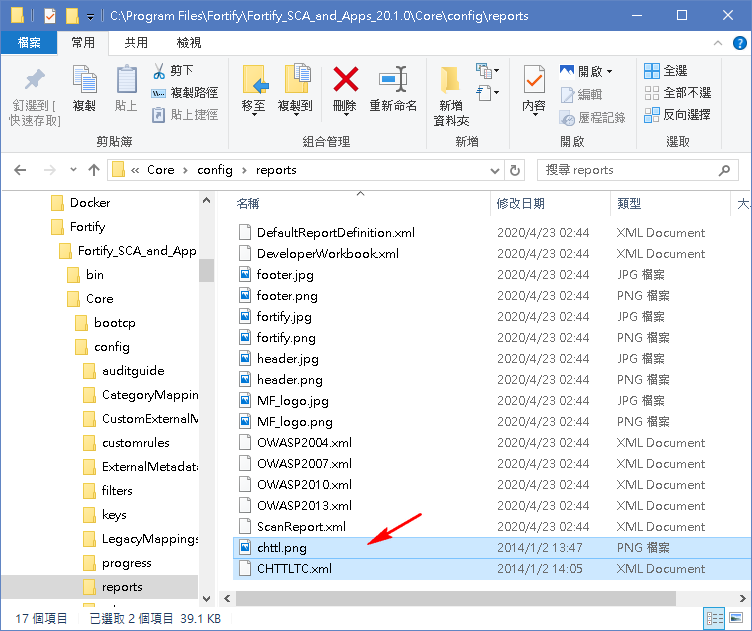

### Rulepacks

`C:\Program Files\Fortify\Fortify_SCA_and_Apps_20.2.0\Core\config\rules`

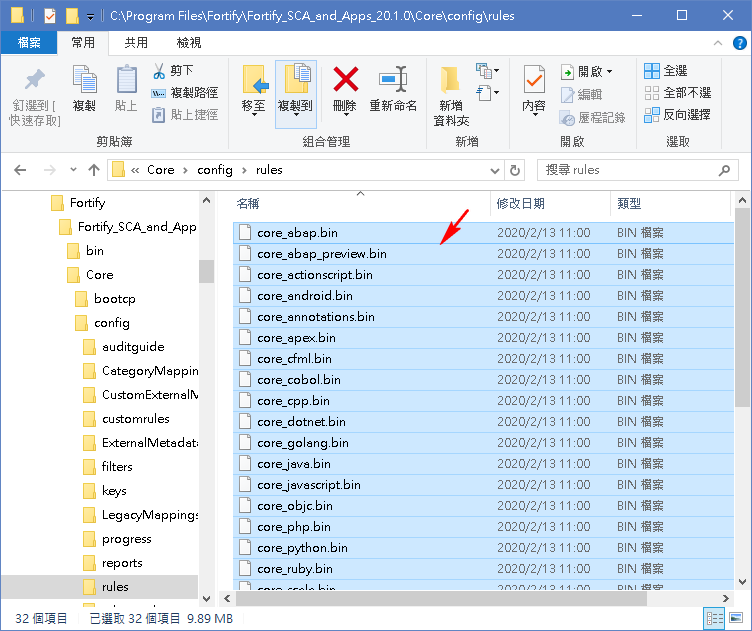

### ExternalMetadata

`C:\Program Files\Fortify\Fortify_SCA_and_Apps_20.2.0\Core\config\ExternalMetadata`

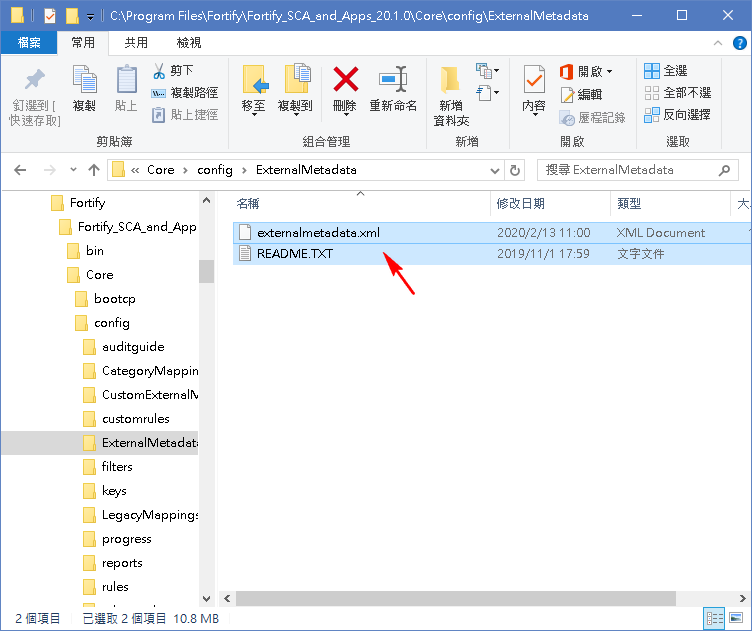

### 中文化

`C:\Program Files\Fortify\Fortify_SCA_and_Apps_20.2.0\bin\`

- scapostinstall.cmd

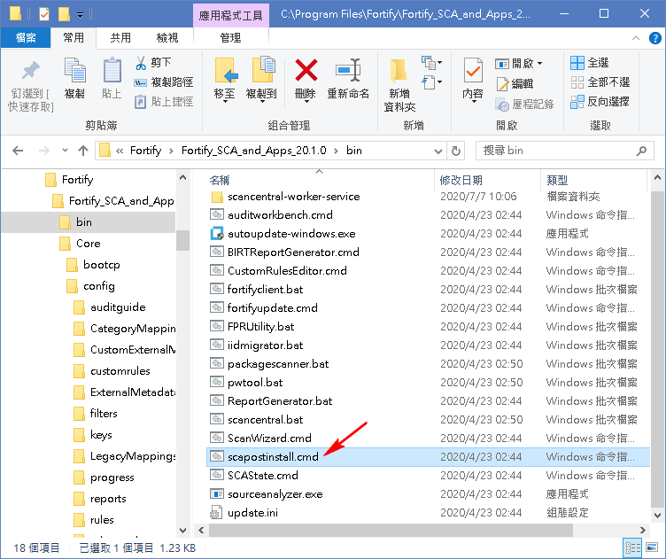
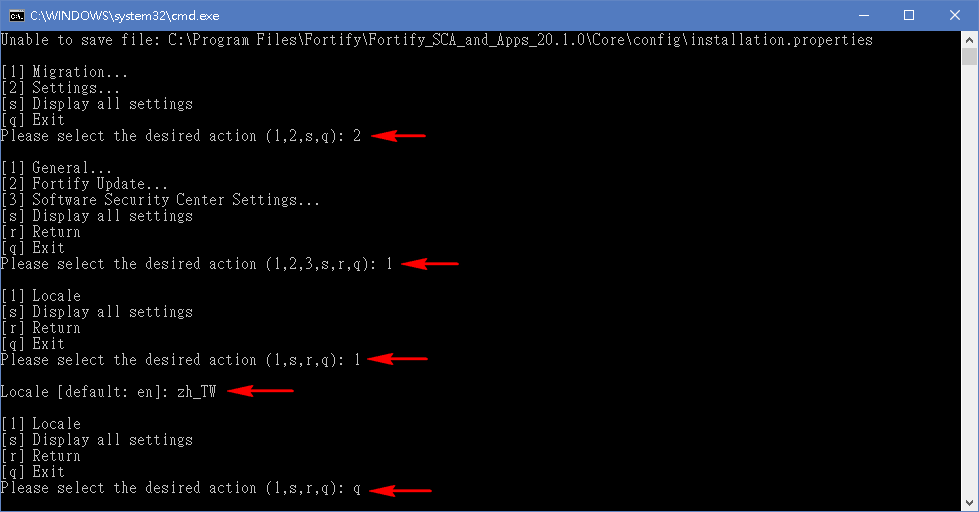

- fortifyupdate.cmd

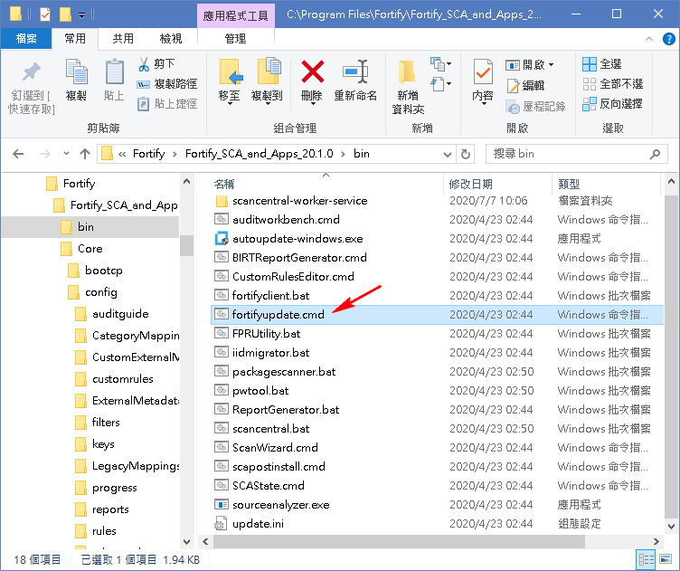

## Scan

1. 啟動 `Audit Workbench`

	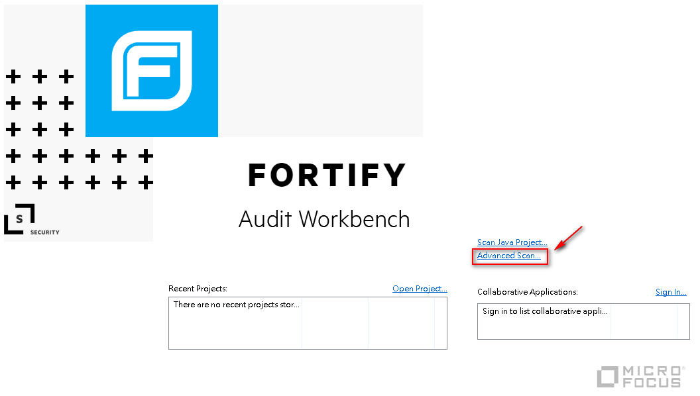

1. 選擇要掃描的專案程式資料夾 `<project>\src\main\`

	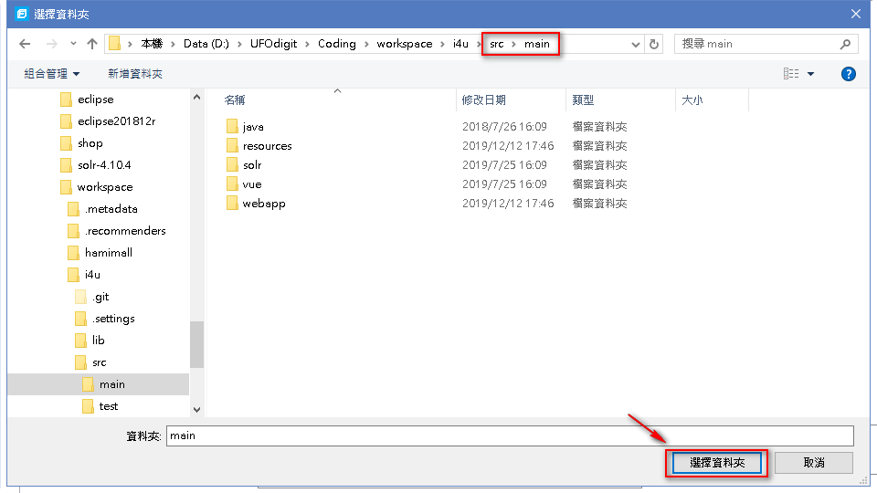

1. 設定所需的 `lib` 與 `專案設定檔` 路徑

	- 分別加入所需的 `lib`

		```
		D:\UFOdigit\Coding\workspace\.metadata\.plugins\org.eclipse.wst.server.core\tmp1\wtpwebapps\i4u\WEB-INF\lib
		```

		```
		D:\UFOdigit\Coding\workspace\i4u\lib
		```

		```
		D:\UFOdigit\Coding\apache-tomcat-8.5.38\lib
		```

	- 分別點選剛加入的 `lib` 設為 `classpath directory`

	- 檢查 java 版本

	- 設定 Build ID 改為專案名稱

	- 設定此次掃描的設定檔儲存路徑

		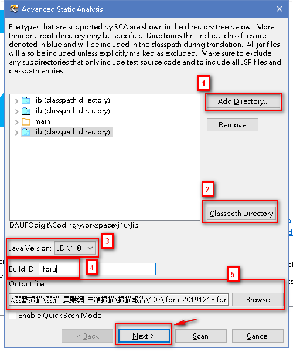

1. 進階參數設定
	
	分別在最後加入下列參數：

	```
	"-encoding"
	"UTF-8"
	"-exclude"
	"D:\UFOdigit\Coding\workspace\i4u\src\main\resources\common.properties;D:\UFOdigit\Coding\workspace\i4u\src\main\resources\beans_boot.xml;D:\UFOdigit\Coding\workspace\i4u\src\main\webapp\kendo\js\kendo.all.min.js;D:\UFOdigit\Coding\workspace\i4u\src\main\webapp\assets\global\scripts\metronic.js"
	```

	```
	"-encoding"
	"UTF-8"
	```

	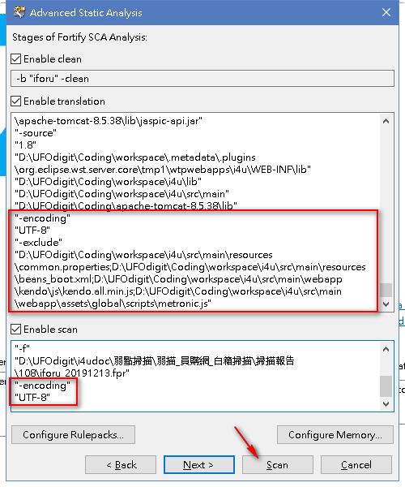

1. 掃描結果確認

	- `Filter Set` 選 `Security Auditor View`。

		這裡顯示的弱點數量才是我們要的。
	
		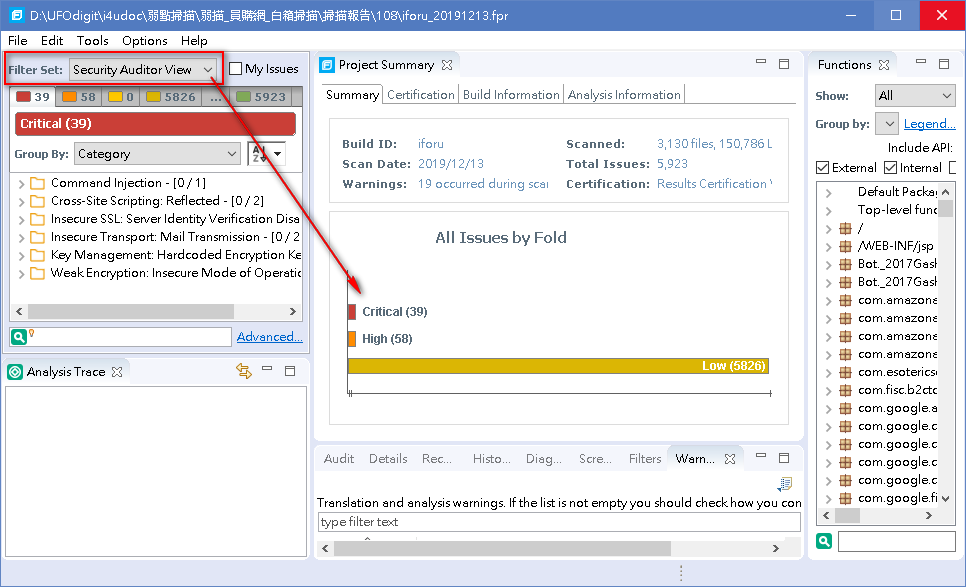
	
	- 確認掃描程式與規則版本。

		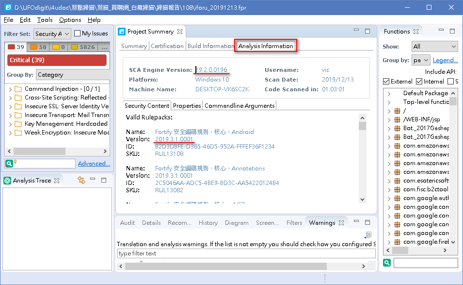
	
	- 下載 `Warnings` 資訊。
	
		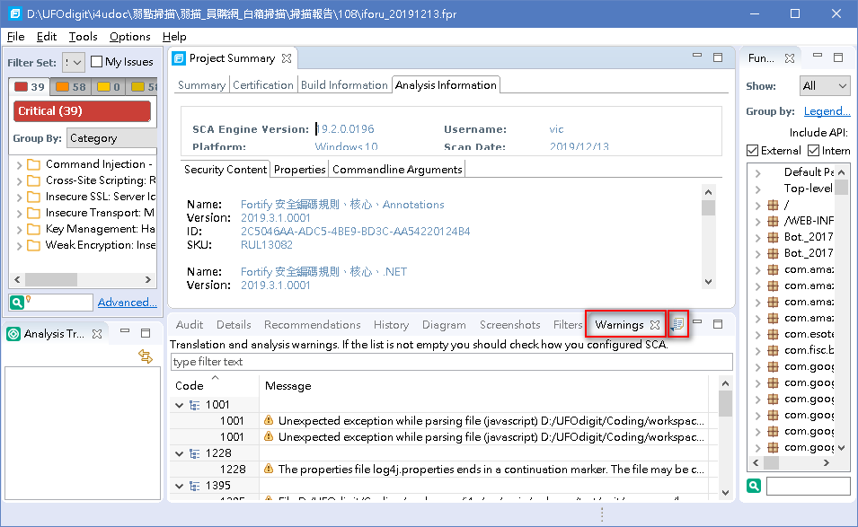


1. 報表匯出

	- 點選 Tools/Reports/Generate Legacy Report

		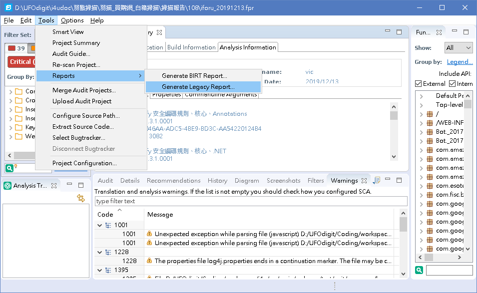
	
	- 選擇 `CHTTLTC` 樣版
	
		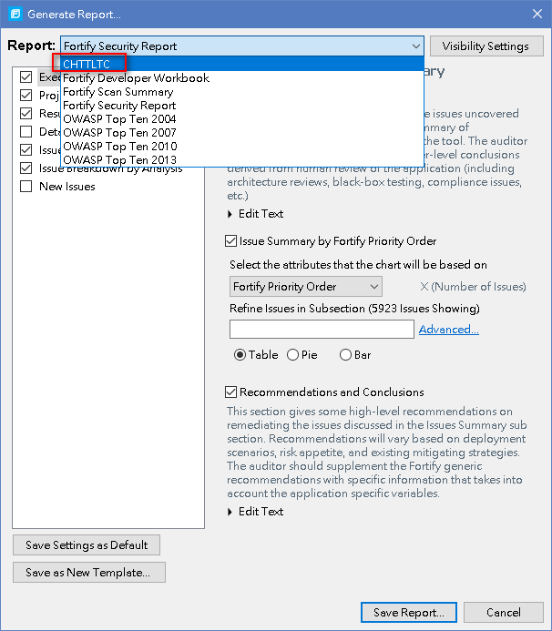
	
	- 選擇 `Save Report`
	
		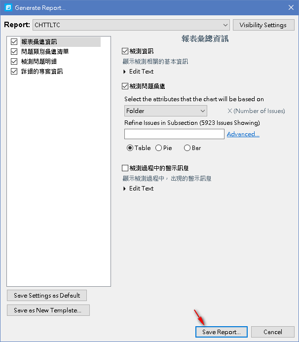
	
	- 確認 `Location`，**分別** 匯出 `PDF` 與 `XML` 格式的報表。

		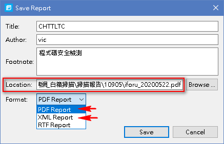

	- 將 `XML` 匯入 Excel 檔並刪除多餘的資訊。

		保留 `Critical`、`High`、`Medium` 等級的弱點並移除多餘的欄位。

		[sample](./info/sample.xlsx)

## Info

refer

- [custom-rule](./info/custom-rule.xml)
- [custom-rule2](./info/custom-rule2.xml)

## Reports

- 202007: [fpr](./reports/202007/iforu_20200707.fpr) | [pdf](./reports/202007/iforu_20200707.pdf) | [xlsx](./reports/202007/iforu_20200707.xlsx)
