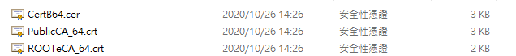

# SSL

## 憑證請求檔製作

完整說明文件請參考：
[中華電信通用憑證管理中心(PublicCA) Apache SSL 憑證請求檔製作與憑證安裝手冊](../third-party/domain-name/Apache-CSR-and-INSTALL.pdf)

### WINDOWS 環境下

1. 下載工程師必備神器 Cmder 最省事，該程式會幫你安裝好 openssl，無須再自行安裝

2. 準備一個目錄放置產生的憑證，這裡以 `D:\SSL` 示範

3. 於 Cmder 製作私密金鑰

```
openssl genrsa -out yourname.key 2048
#yourname 為自訂檔名，2048 則是 RSA 2048 位元加密，亦可使用4096位元，依公司規定
Generating RSA private key, 2048 bit long modulus (2 primes)
.............................................................................................................................................+++++
............................................................................................................................................................................................+++++
e is 65537 (0x010001)
```

4. 製作請求檔

```
openssl req -new -key yourname.key -out your.domain.name.req
```

5. 填寫需求檔資訊：
```
# 國碼臺灣是 TW
Country Name (2 letter code) [AU]:TW
# 國名臺灣填 Taiwan
State or Province Name (full name) [Some-State]:Taiwan R.O.C
# 地名
Locality Name (eg, city) []:Taoyuan
# 組織單位名稱(公司名)
Organization Name (eg, company) [Internet Widgits Pty Ltd]:company name
# 部門名稱
Organizational Unit Name (eg, section) []:department name
# 憑證的名稱 (通常為伺服器 FQDN)，這裏的 FQDN 前面還有個 `*`，表示申請萬用憑證。
Common Name (eg, YOUR name) []:*.your.domain.name
# 申請人的聯絡信箱
Email Address []:who@your.email.domain    
```

6. 之後就可以用 `your.domain.name.req` 申請憑證

## 設定中繼憑證

1. 取得簽發下來的憑證，共有三個檔案如下，其中利用 `PublicCA_64.crt` 或是 `ROOTeCA_64.crt` 另外匯出成憑證串鏈檔 `eCA_PublicCA.p7b`



2. 打開 PublicCA_64.crt


3. 出現以下憑證檢視的畫面，請點選「詳細資料」


4. 憑證詳細資料的畫面，請點選「複製到檔案」


5. 憑證匯出精靈的畫面，請點選「下一步」


6. 勾選「密碼編譯訊息語法標準-PKCS#7憑證」及「如果可能的話，在憑證路徑中包含所有憑證」兩個選項，然後點選「下一步」


7.點選「瀏覽」，出現另存新檔的畫面，請選擇適當的資料夾位置，檔案名稱請輸入「eCA_PublicCA」，然後點選「存檔」


8. 出現以下憑證匯出精靈的畫面，請點選「下一步」，再點選完成


9. PublicCA CA憑證之憑證串鏈的取得之後，由於是 DER 編碼格式，因此必須轉換為 PEM 編碼格式才能匯入 AWS

```
openssl pkcs7 -in eCA_PublicCA.p7b -inform DER -print_certs -out eCA_PublicCA.pem
```

## AWS 憑證匯入

1. 打開 AWS Certificate Manager (ACM)，ACM 是 Amazon 的憑證管理中心，因為員購網的憑證不是在 AWS 申請購買的，所以需要另外將外部申請的憑證匯入到 ACM


2. 選匯入憑證


3. 三個設定 SSL 連線所需要的檔案，與 Apache 與 AWS ACM 設定時的對應關係

|    File               | Description         | Apache SSL Config    |AWS ACM                                 |
|-----------------------|---------------------|----------------------|----------------------------------------|
| CertB64.cer           | 簽發下來的憑證      | CertificateFile      | Certificate Body (憑證內文)            |
| your.domain.name.key  | 私鑰                | CertificateKeyFile   | Certificate private key (憑證私有金鑰) |
| eCA_PublicCA.pem      | 憑證串鏈檔          | CertificateChainFile | Certificate chain (憑證鏈)             |

4. 對應的檔案內容分別貼到 ACM 頁面中憑證內文、憑證私有金鑰、憑證鏈的欄位，接著按下一步繼續


5. tag 可選擇性輸入，也可保留空白不影響


6. 最後可以看到頁面顯示的憑證資訊，沒問題的話按匯入即可


## Apache 憑證安裝

1. 製作放置 `CertificateFile` `CertificateKeyFile` `CertificateChainFile` 的目錄，將 `CertB64.cer` `your.domain.name.key` `eCA_PublicCA.pem` 放入

```sh
mkdir /etc/httpd/cert
```

```sh
chown -R root:root /httpd/cert
chmod -R 600 /httpd/cert
```

2. 編輯 ssl.conf

```sh
vim /etc/httpd/conf.d/ssl.conf
```

```sh
#SSLCertificateFile /etc/pki/tls/certs/localhost.crt
SSLCertificateFile /etc/httpd/cert/CertB64.cer
#即憑證路徑, 請指向放置憑證檔的路徑 

#SSLCertificateKeyFile /etc/pki/tls/private/localhost.key
SSLCertificateKeyFile /etc/httpd/cert/your.domain.name.key
#即私鑰路徑, 請指向放置私鑰檔的路徑 

#SSLCertificateChainFile /etc/pki/tls/certs/server-chain.crt 
SSLCertificateChainFile /etc/httpd/cert/eCA_PublicCA.pem
#若您申請購買SSL伺服器數位憑證, 您務必要設定為購買的SSL憑證 
```

3. 重啟 `httpd`

```sh
service httpd restart
```