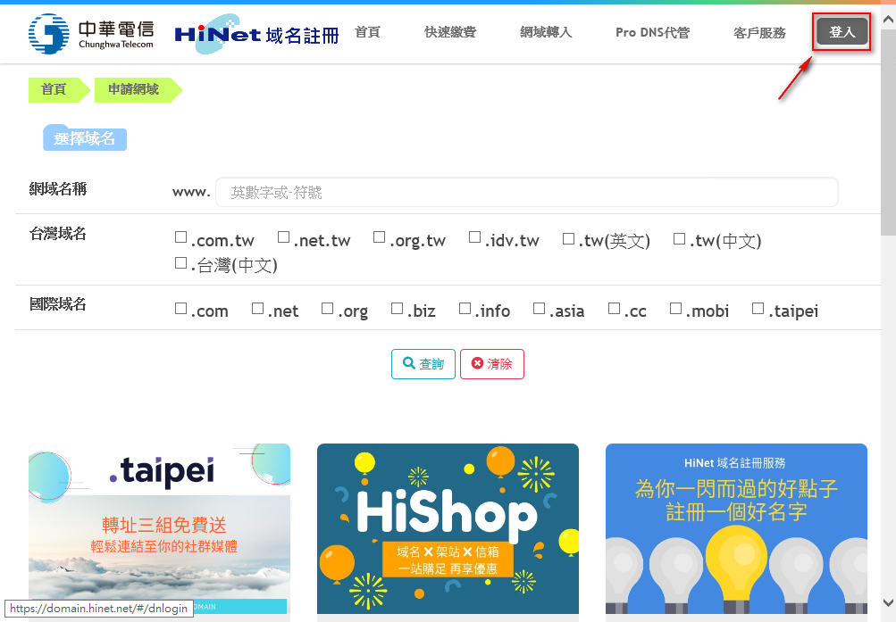
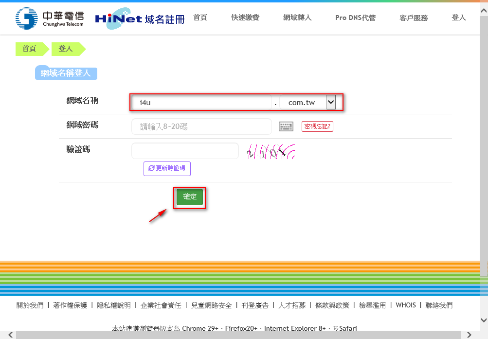
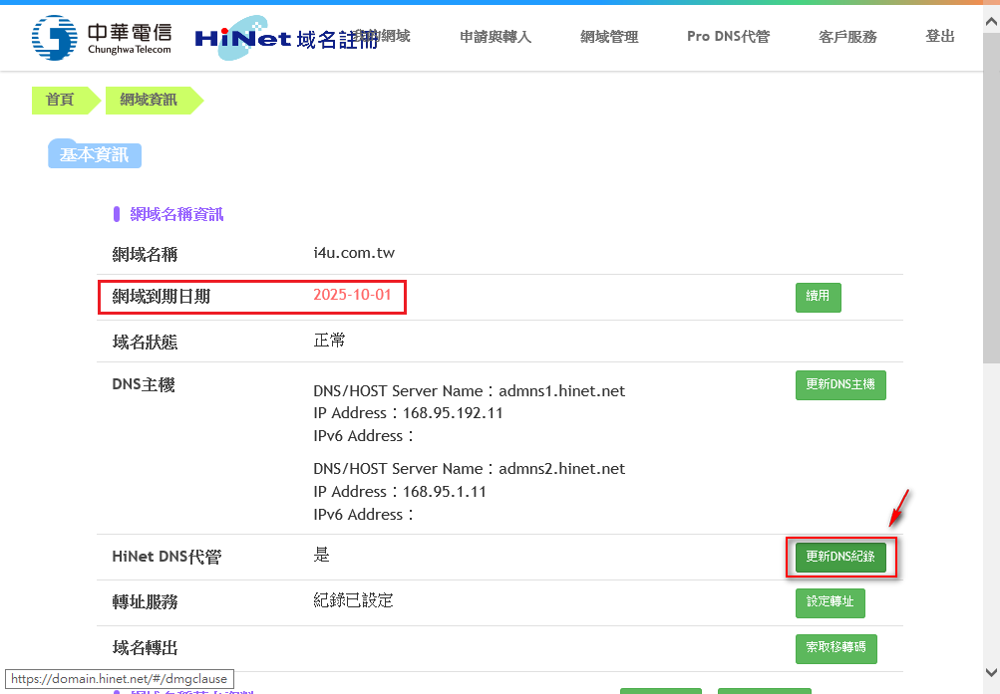
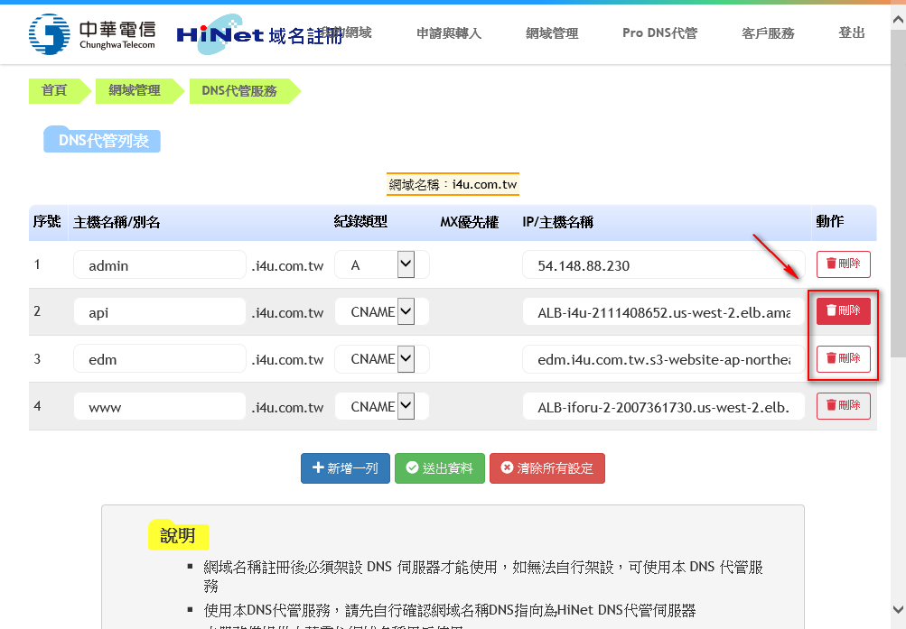
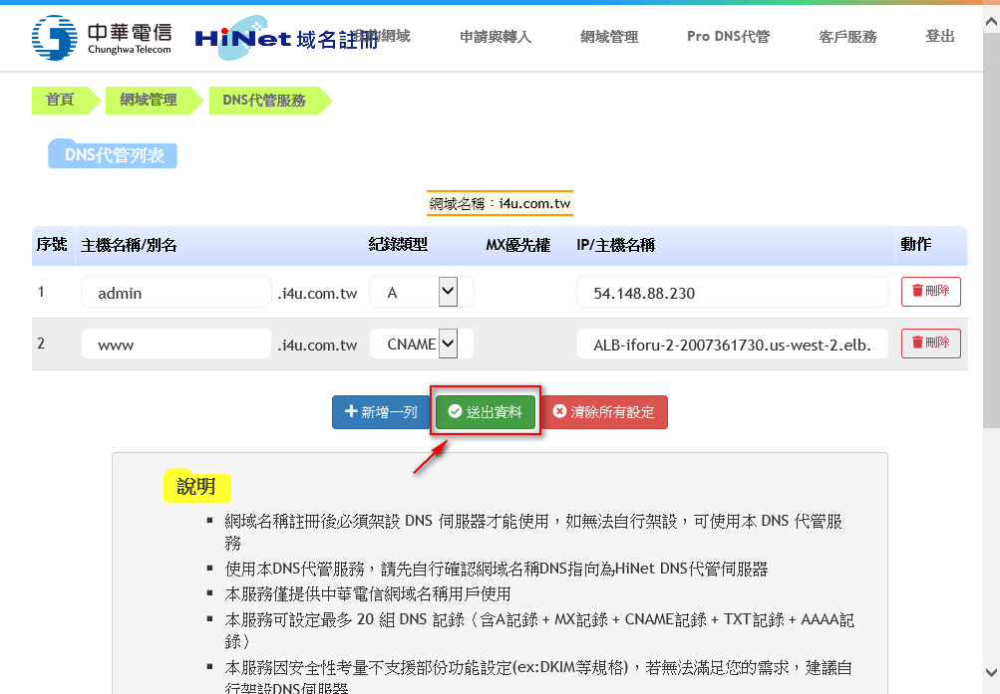
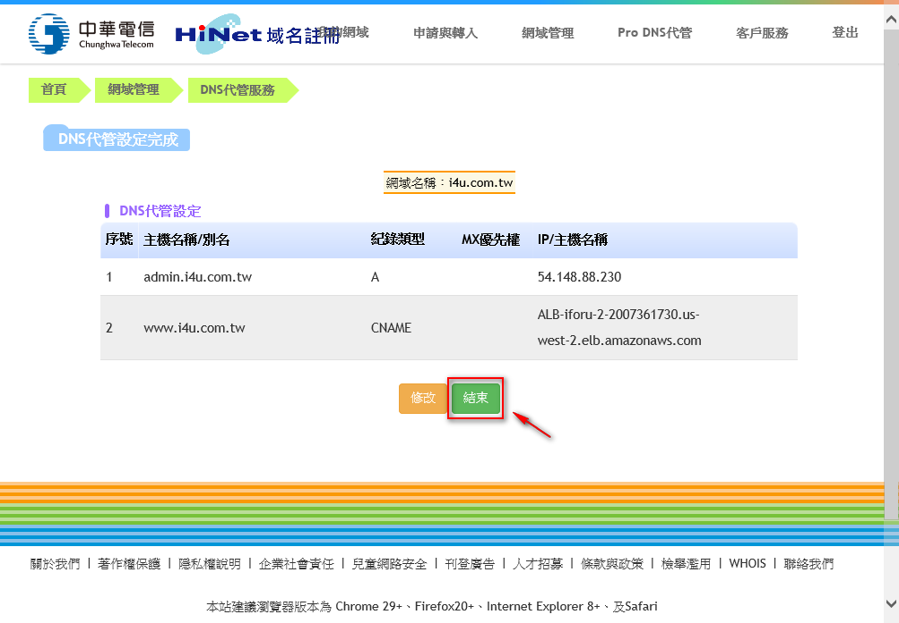

# DOMAIN NAME

共有三個 Domain，皆托管於 Hinet <https://domain.hinet.net/>。  
請用 IE 登入操作。  
操作範例：













## i4u.com.tw

網域到期日期：2025-10-01

| 序號 | FQDN             | Type  | IP/Name                                            |
| :--: | ---------------- | :---: | -------------------------------------------------- |
|  1   | www.i4u.com.tw   | CNAME | ALB-iforu-2-2007361730.us-west-2.elb.amazonaws.com |


## iforu.com.tw

網域到期日期：2021-11-02

| 序號 | FQDN                 | Type  | IP/Name                                            |
| :--: | -------------------- | ----- | -------------------------------------------------- |
|  1   | admin.iforu.com.tw   | CNAME | ALB-iforu-2-2007361730.us-west-2.elb.amazonaws.com |
|  2   | edm.iforu.com.tw     | CNAME | d8z5g12rybkgy.cloudfront.net                       |
|  3   | www.iforu.com.tw     | CNAME | ALB-iforu-2-2007361730.us-west-2.elb.amazonaws.com |
|  4   | shop.iforu.com.tw    | CNAME | ALB-iforu-2-2007361730.us-west-2.elb.amazonaws.com |
|  5   | api.iforu.com.tw     | CNAME | ALB-iforu-2-2007361730.us-west-2.elb.amazonaws.com |
|  6   | product.iforu.com.tw | CNAME | ALB-product-1977074933.us-west-2.elb.amazonaws.com |

## iforu.cht.com.tw 測試環境目前託管於院內的 DOMAIN 伺服器

網域到期日期：2021-11-02

| 序號 | FQDN                    | Type  | IP/Name      |
| :--: | ----------------------- | :---: | -------------|
|  1   | iforu.cht.com.tw        |   A   | 54.92.89.189 |


註：

```
tsmcewc.com
      redirect https://shop.iforu.com.tw/tsmc
www   redirect https://shop.iforu.com.tw/tsmc
(原http://tsmc.park101.com.tw/login.php)
```

## 憑證

完整說明文件請參考：
[中華電信通用憑證管理中心(PublicCA) Apache SSL 憑證請求檔製作與憑證安裝手冊](./Apache-CSR-and-INSTALL.pdf)

- @Domain.forugoal.com.tw
- @Domain.i4u.com.tw
- @Domain.iforu.com.tw

| 憑證                      | 到期日                 |
| ------------------------- | ---------------------- |
| \iforu.cht.com.tw         | 2021-11-02T06:52:01UTC |
| \*.i4u.com.tw             | 2021-11-02T06:27:02UTC |
| \*.iforu.com.tw           | 2021-11-02T06:27:02UTC |

### 製作私鑰與需求檔

以 `iforu.com.tw` 為例：

```sh
mkdir /etc/httpd/cert
cd /etc/httpd/cert
openssl genrsa -out iforu.com.tw.key 2048
openssl req -new -key iforu.com.tw.key -out iforu.com.tw.req
```

其中的需求檔填寫資訊如下：

```
Country Name (2 letter code) [AU]:TW                                 //國碼臺灣是 TW
State or Province Name (full name) [Some-State]:Taiwan R.O.C         //國名臺灣填 Taiwan
Locality Name (eg, city) []:Taoyuan                                  //地名
Organization Name (eg, company) [Internet Widgits Pty Ltd]:CHT TL    //組織單位名稱
Organizational Unit Name (eg, section) []:UFO Digit                  //部門名稱
Common Name (eg, YOUR name) []:*.iforu.com.tw                        //憑證的名稱 (通常為伺服器 FQDN)
Email Address []:mio@cht.com.tw                                      //申請單位的聯絡信箱
```

### 填寫 `eFrom` 相關申請單

### 取得簽發下來的憑證

共有三個檔案如下，其中 `PublicCA_64.crt` & `ROOTeCA_64.crt` 另外匯出成憑證串鏈檔 `eCA_PublicCA.p7b`。

- CertB64.cer
- PublicCA_64.crt
- ROOTeCA_64.crt

再將憑證串鏈檔 `eCA_PublicCA.p7b` 由 DER 編碼格式轉成 PEM 編碼格式(Base64)：

```sh
openssl pkcs7 -in eCA_PublicCA.p7b -inform DER -print_certs -out eCA_PublicCA.pem
```

## 憑證檔案設定

經過上面的步驟，最終會得到三個設定加密連線所需要的檔案，下面一併整理出在 `Apache` 與 `AWS ELB` 設定時的對映關係。

| File             | Descript       | Apache SSL Config    | AWS ACM                                |
| ---------------- | -------------- | -------------------- | -------------------------------------- |
| CertB64.cer      | 簽發下來的憑證 | CertificateFile      | Certificate Body (憑證內文)            |
| iforu.com.tw.key | 私鑰           | CertificateKeyFile   | Certificate private key (憑證私有金鑰) |
| eCA_PublicCA.pem | 憑證串鏈檔     | CertificateChainFile | Certificate chain (憑證鏈)             |
